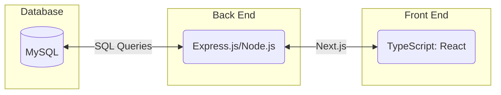

# Yahtzee - Team 22


### Initial Roles: 

- Griffin - Backend
- Jess  - Interface Designer & Frontend
- Ben - Backend
- Aayush - Backend
- Carmen - Database administrator 
- Eric  - Frontend

### Scrum Masters and Product Owners:

| Sprint   | Scrum Master  | Product Owner |
| ---------| ------------- | ------------- |
| 0  | Carmen | Jess  |
| 1  | Carmen | Jess  |
| 2  | Ben | Eric  |
| 3  | Griffin | Aayush  |

### Project Abstract

<!-- This is an example paragraph written in markdown. You can use *italics*, **bold**, and other formatting options. You can also <u>use inline html</u> to format your text. The example sections included in this document are not necessarily all the sections you will want, and it is possible that you won't use all the one's provided. It is your responsibility to create a document that adequately conveys all the information about your project specifications and requirements. -->

We will an application for the game Yahtzee. The basic version will allow users to play the game with full functionality against other users. The application will include a graphical user interface that depicts all components of the game including the dice and score card. As an additional feature, writing and dice-rolling animations can be added to the game.


### Customer

<!--A brief description of the customer for this software, both in general (the population who might eventually use such a system) and specifically for this document (the customer(s) who informed this document). Every project will have a customer from the CS506 instructional staff. Requirements should not be derived simply from discussion among team members. Ideally your customer should not only talk to you about requirements but also be excited later in the semester to use the system.-->

Our customer will be ...

### User Requirements

<!--This section lists the behavior that the users see. This information needs to be presented in a logical, organized fashion. It is most helpful if this section is organized in outline form: a bullet list of major topics (e.g., one for each kind of user, or each major piece of system functionality) each with some number of subtopics.-->

| ID   | Description                                                  | Priority | Status |
| ---- | ------------------------------------------------------------ | -------- | ------ |
| R1  | Users will not need to sign in but will need to enter their name and the game room they wish to join/create. | High      | Open   |
| R2  | The user should pick a single or multi-player mode first, the interface will vary depending on how many people join the game. | Med     | Open   |
| R3  | A user can only have three dice roll. | High     | Open   |
| R4  | A user can only select scoring options based on the rolled dice. | High      | Open   |
| R5  | The user should be able to end their turn within their three rolls. | Med     | Open   |
| R6  | The game  will end when all scores have been entered. | High     | Open   |
| R7  | The user should be able to see their opponents dice roll but can't change any scores. | Med     | Open   |
| R8  | Any user should be able to cancel or restart the game. | Med     | Open   |


### Use Cases & User Stories

<!--Use cases and user stories that support the user requirements in the previous section. The use cases should be based off user stories. Every major scenario should be represented by a use case, and every use case should say something not already illustrated by the other use cases. Diagrams (such as sequence charts) are encouraged. Ask the customer what are the most important use cases to implement by the deadline. You can have a total ordering, or mark use cases with “must have,” “useful,” or “optional.” For each use case you may list one or more concrete acceptance tests (concrete scenarios that the customer will try to see if the use case is implemented).-->


#### Must Have
> As a player, to choose the game mode, I will select whether I want to play against a computer or my friends with a code.

> As a player, to complete my turn, I will roll the dice and enter in my score by the end of my rolls.

#### Useful
> As a player, I will see my opponents turn in real time.

> As a player, to know how well I'm doing, I will see my total score being calculated after each round.

#### Optional
> As a player, if I don't want to play anymore, I will be able to restart or exit the game.

### User Interface Requirements

<!--Describes any customer user interface requirements including graphical user interface requirements as well as data exchange format requirements. This also should include necessary reporting and other forms of human readable input and output. This should focus on how the feature or product and user interact to create the desired workflow. Describing your intended interface as “easy” or “intuitive” will get you nowhere unless it is accompanied by details.-->

<!--NOTE: Please include illustrations or screenshots of what your user interface would look like -- even if they’re rough -- and interleave it with your description.-->

Designs are included in this [Figma](https://www.figma.com/file/29ScxYvUkUIzsT6dDg4BiT/Yahtzee---CS-506?type=design&node-id=0%3A1&mode=design&t=0b9IeLJuQuYfnRvv-1) document

Flow is as follows:
1. User enters the application and will need to select whether they want to play in single player or multi player mode.
2. User will need to enter their name (and game code if selected multi-player) to start game
3. User will get the first turn and has three dice rolls before they must select a number on the score card to complete their turn.
4. Opponent will finish their turn and rounds will complete until the score card has been completed.
5. Computer will calculate total and announce the winner.
6. User will have the option to replay with the same people or quit.

<!-- ### Security Requirements -->

<!--Discuss what security requirements are necessary and why. Are there privacy or confidentiality issues? Is your system vulnerable to denial-of-service attacks?-->

<!-- ### System Requirements -->

<!--List here all of the external entities, other than users, on which your system will depend. For example, if your system inter-operates with sendmail, or if you will depend on Apache for the web server, or if you must target both Unix and Windows, list those requirements here. List also memory requirements, performance/speed requirements, data capacity requirements, if applicable.-->

<!-- | You    |    can    |    also |
| ------ | :-------: | ------: |
| change |    how    | columns |
| are    | justified |         | -->

### Specification

<!--A detailed specification of the system. UML, or other diagrams, such as finite automata, or other appropriate specification formalisms, are encouraged over natural language.-->

<!--Include sections, for example, illustrating the database architecture (with, for example, an ERD).-->

<!--Included below are some sample diagrams, including some example tech stack diagrams.-->

<!-- You can make headings at different levels by writing `# Heading` with the number of `#` corresponding to the heading level (e.g. `## h2`). -->

#### Technology Stack





#### Database

<!-- ```mermaid
---
title: Sample Database ERD for an Order System
---
erDiagram
    Customer ||--o{ Order : "placed by"
    Order ||--o{ OrderItem : "contains"
    Product ||--o{ OrderItem : "included in"

    Customer {
        int customer_id PK
        string name
        string email
        string phone
    }

    Order {
        int order_id PK
        int customer_id FK
        string order_date
        string status
    }

    Product {
        int product_id PK
        string name
        string description
        decimal price
    }

    OrderItem {
        int order_item_id PK
        int order_id FK
        int product_id FK
        int quantity
    }
``` -->

<!-- #### Class Diagram -->

<!-- ```mermaid
---
title: Sample Class Diagram for Animal Program
---
classDiagram
    class Animal {
        - String name
        + Animal(String name)
        + void setName(String name)
        + String getName()
        + void makeSound()
    }
    class Dog {
        + Dog(String name)
        + void makeSound()
    }
    class Cat {
        + Cat(String name)
        + void makeSound()
    }
    class Bird {
        + Bird(String name)
        + void makeSound()
    }
    Animal <|-- Dog
    Animal <|-- Cat
    Animal <|-- Bird
``` -->

#### Flowchart


<!-- #### Behavior -->


#### Sequence Diagram


## Coding Style and Naming Conventions
<!--Here you can document your coding standards and conventions. This includes decisions about naming, style guides, etc.-->

### Language

This project will use TypeScript with React for the frontend, Next.js for the backend, and a MySQL database.

### Coding Style

We adhere to clean and readable code following common TypeScript conventions. Please make sure your code follows these conventions.

### Naming Conventions

1. **Variables**: Use meaningful and descriptive names for variables. Follow the camelCase naming convention.

    ```typescript
    // Good
    const userName = "JohnDoe";
    
    // Avoid
    const un = "JohnDoe";
    ```

2. **Functions/Methods**: Use verbs or verb phrases for function names. Follow the camelCase naming convention.

    ```typescript
    // Good
    function calculateTotal(price: number, quantity: number): number {
        return price * quantity;
    }
    
    // Avoid
    function total(p: number, q: number): number {
        return p * q;
    }
    ```

3. **Constants**: Use uppercase letters with underscores for constant variable names.

    ```typescript
    // Good
    const MAX_RETRIES = 3;
    
    // Avoid
    const maxRetries = 3;
    ```

